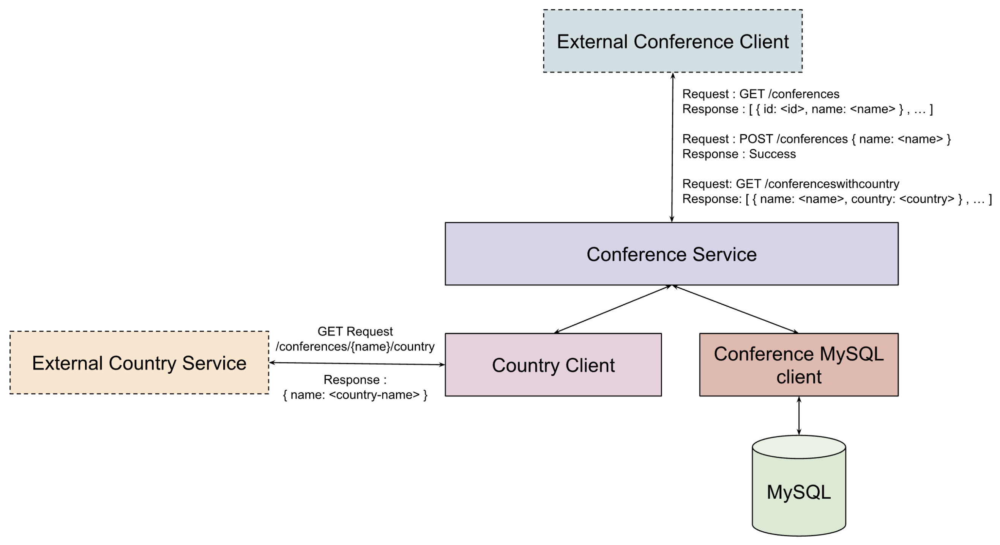

# Conference Service

A RESTful conference service example. The following diagram shows the outline of this conference application:

The application has a `Conference Service` that exposes the following resources:

- `GET /conferences` : returns an array of conferences with the name and the id
- `POST /conferences` : creates a conference resource with a name
- `GET /conferenceswithcountry` : returns an array of conferences with the name and the country

The conference resources are stored and retrieved from the MySQL database. The country of the conference is retrieved by making a request to an external Country Service endpoint.
